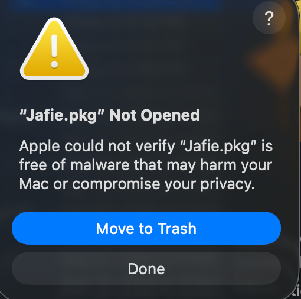
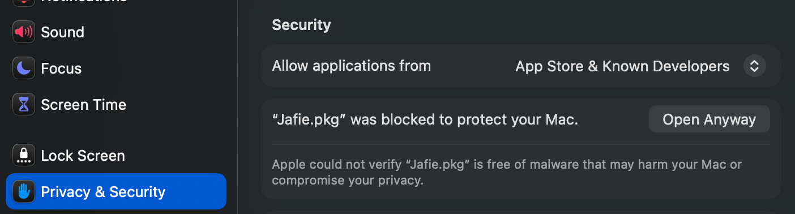
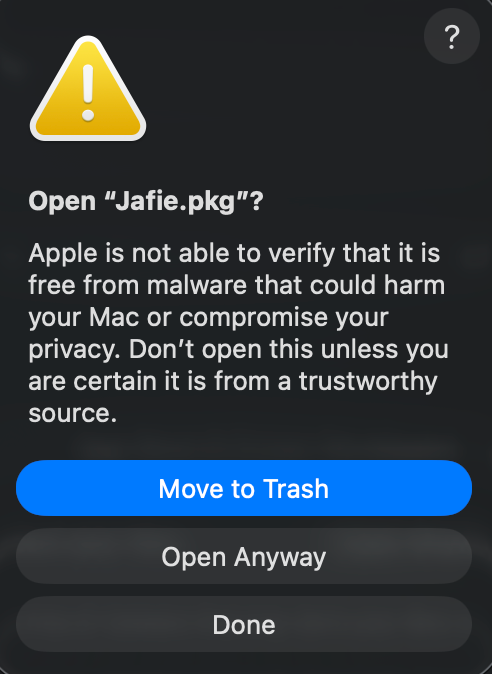
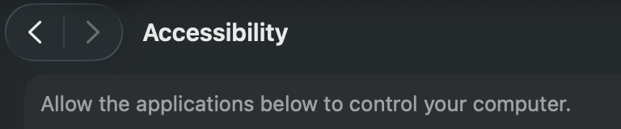
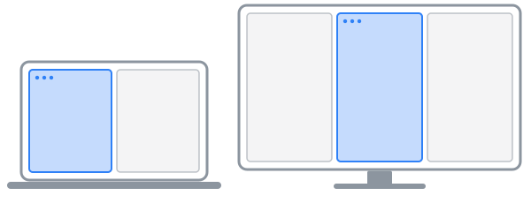
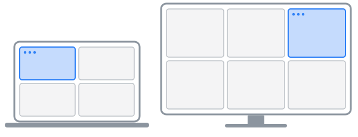
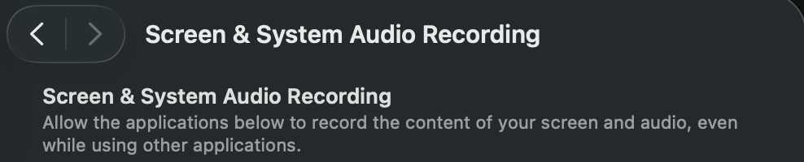
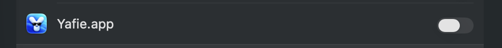
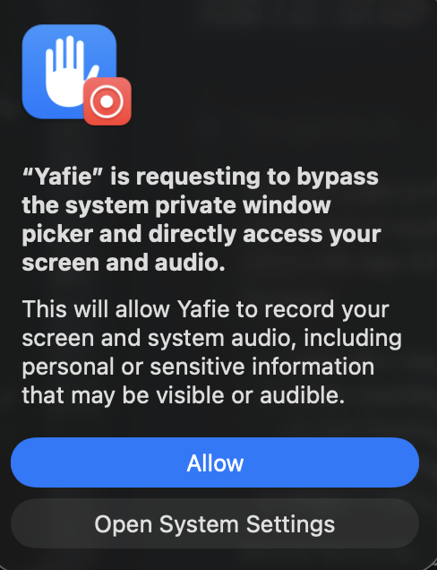
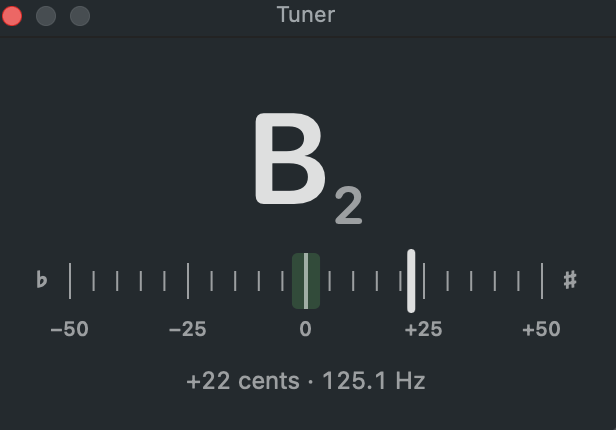

<p align="center"></p>

<h1 align="center">Yafie</h1>

<p align="center">A Mac menu bar app with only the features I use.</p>

<p align="center"><a href="https://github.com/jfreema/yafie/raw/main/downloads/Yafie.pkg"></a></p>

<p align="center">Version 1.0.1 · macOS 14 or later · Apple silicon or Intel</p>

<table>
  <tr>
    <td width="50%"><b><a href="#app-preview">App preview</a></b><br>Rest the pointer on an app in the Dock to see its windows, and click the one you want.</td>
    <td width="50%"><b><a href="#window-snapping">Window snapping</a></b><br>⌃⌥ and an arrow key put the front window into halves, thirds, quarters or sixths.</td>
  </tr>
  <tr>
    <td width="50%"><b><a href="#screenshot-tool">Screenshot tool</a></b><br>⌃⌥P snips part of the screen to copy, save or mark up, or copies the text in it.</td>
    <td width="50%"><b><a href="#guitar-tuner">Guitar tuner</a></b><br>Shows the note you're playing and how sharp or flat it is.</td>
  </tr>
  <tr>
    <td width="50%"><b><a href="#drum-machine">Drum machine</a></b><br>Tap a beat on the trackpad, with a metronome and a loop to play along to.</td>
    <td width="50%"><b><a href="#stay-awake-with-the-lid-closed">Stay awake with the lid closed</a></b><br>Keeps a MacBook running with its lid shut, plugged in or on battery.</td>
  </tr>
</table>

## Install

1. Open the **Yafie.pkg** you downloaded.
2. macOS blocks it the first time, because Yafie isn't signed with a paid Apple Developer ID. Click **Done**, then **Open Anyway** in **System Settings → Privacy & Security** (there for about an hour), then **Open Anyway** again, and enter your password.

   | 1. Click **Done** | 2. Click **Open Anyway** | 3. Click **Open Anyway** |
   |---|---|---|
   |  |  |  |

3. Click through the installer and enter your password. Yafie opens, and its icon appears in the menu bar.
4. Click Yafie in the menu bar and turn on **Open at Login**.

To update, choose **Check for Updates…** in Yafie's menu. Yafie installs the newest version and restarts, keeping your settings.

---

## App preview

Rest the pointer on an open app's icon in the Dock to see its windows, then click the one you want. With a regular and a private Chrome window open, for example, you go straight to the right one.

**Turn it on:**

1. Click Yafie in the menu bar and turn on **Show App Previews in the Dock**.
2. When macOS asks, click **Open System Settings**, or choose **Allow App Previews…** in Yafie's menu. Turn on **Yafie.app** in the **Accessibility** list, as for [window snapping](#window-snapping).
3. For pictures of the windows, choose **Allow App Previews…** again and turn on **Yafie.app** in the **Screen & System Audio Recording** list, as for the [screenshot tool](#screenshot-tool). Then click **Quit & Reopen**. Without it, the previews show only the windows' titles.

If window snapping and the screenshot tool are already on, Yafie has both permissions, so step 1 is all it takes.

**Use it:** rest the pointer on an open app's icon in the Dock. Its windows appear above the icon, or beside it with the Dock on the side. Click one to bring it to the front, or click the × in its corner to close that window. Move the pointer away, or click anywhere else, to close the previews.

The previews show the app's windows on the current desktop, oldest first, so each keeps its place. Minimized ones are dimmed.

---

## Window snapping

Hold Control (⌃) and Option (⌥) and press an arrow key to put the front window into halves, thirds, quarters or sixths of its display.

**Turn it on:**

1. Click Yafie in the menu bar and turn on **Snap Windows with ⌃⌥ Arrow Keys**.
2. When macOS asks, click **Open System Settings**, or choose **Allow Window Snapping…** in Yafie's menu.
3. Turn on **Yafie.app** and enter your password or use Touch ID. The keys work within a couple of seconds.

   | Find the **Accessibility** list | Turn on **Yafie.app** |
   |---|---|
   |  |  |

**Use it:**

- **⌃⌥← and ⌃⌥→** snap the window into the column it's mostly in, then move it a column at a time, across displays.
- **⌃⌥↑** widens it to fill the display. From a third, it goes to two thirds first.
- **⌃⌥↓** moves it clockwise through the display's quarters, or sixths.

Each display has two columns, or three on external displays with **Snap to Thirds on External Displays** on.

| ⌃⌥← and ⌃⌥→ | ⌃⌥↓ |
|---|---|
|  |  |

---

## Screenshot tool

Press ⌃⌥P to snip part of the screen, then copy it, save it, mark it up with boxes, lines, arrows, highlights and text, or copy the text in it.

**Turn it on:**

1. Click Yafie in the menu bar and turn on **Snipping Tool with ⌃⌥P**. Nothing appears yet: macOS just adds Yafie to its list, switched off.
2. Choose **Allow Screen Snipping…** in Yafie's menu, then turn on **Yafie.app** and enter your password or use Touch ID.

   | Find the **Screen & System Audio Recording** list | Turn on **Yafie.app** |
   |---|---|
   |  |  |

3. Click **Quit & Reopen**.
4. Take your first snip. macOS asks whether Yafie can bypass the system private window picker. Click **Allow**, then take the snip again. macOS asks this again about once a month.

   

**Use it:** press ⌃⌥P and drag across part of the screen, as with ⌘⇧4. Press Space to pick a whole window instead, or Esc to cancel. A menu opens where you let go, with **Copy to Clipboard**, **Copy Text**, **Open in Editor** and **Save…**.

**Copy Text** copies the words in the snip as plain text, line by line, even where you can't select them, like an error message, a paused video or a scanned PDF. Your Mac reads them itself, without sending the snip anywhere.

In the editor, drag to draw. Hold Shift to keep lines and arrows to 45° steps, and boxes and highlights square. For text, click where it goes, type, and press Return. **Outline** puts white, red or black around boxes, lines, arrows and text, so they stand out on any snip, and **Size** sets text from 10 to 16 points.

| Keys | What they do |
|---|---|
| R, L, A, H, T | Box, line, arrow, highlight, text |
| 1, 2, 3, 4 | Red, green, blue, yellow |
| W | Thin or thick lines |
| ⌘Z, ⇧⌘Z | Undo, redo |
| ⌘C | Copy it with its shapes. The editor stays open. |
| ⌘S | Save it with its shapes. The editor closes. |
| ⌘Q | Close the editor. Yafie stays in the menu bar. |

---

## Guitar tuner

Shows the note you're playing and how sharp or flat you are, and says **In tune** within 3 cents. Any tuning works, with A4 at 440 Hz.

**Use it:** choose **Guitar Tuner…** in Yafie's menu, click **Allow** for the microphone the first time, and play a string. Yafie listens only while the tuner is open, and its menu bar icon turns green, then yellow, orange and red as the sound gets louder.



It uses the input chosen in **System Settings → Sound → Input**, unless that's a Bluetooth or virtual input. Then it uses the Mac's own microphone, since opening a Bluetooth headset's microphone can make it suddenly much louder. On an audio interface, it uses the louder of inputs 1 and 2. It only ever listens and never plays sound.

---

## Drum machine

Tap out a beat on the trackpad, with a metronome, and loop a bar or 4 bars of it to play along to.

**Use it:** choose **Drum Machine…** in Yafie's menu. The trackpad is the kit: tap its top left for the snare, its top right for the kick, and anywhere along the bottom for a hi-hat. Taps play the drums while the drum machine is the front window and the pointer is over its pads. You can also click the pads.

- **Play** starts the metronome, and **Stop** stops it. Space does both. Set **Tempo** from 40 to 240 beats a minute, or turn **Metronome** off.
- **Record** records what you play for one pass of the **Loop**, a bar or 4 bars, then plays it over and over. From a stop, a bar's count-in comes first. Record again to add more, or **Clear** to start over.
- **Quantize** snaps hits as they're recorded to the nearest quarter (1/4), eighth (1/8) or sixteenth note (1/16), which starts out chosen. **None** keeps them where you played them.

Bluetooth headphones play everything a moment late, which makes it hard to play along. Use wired ones or the Mac's speakers.

---

## Stay awake with the lid closed

Keeps a MacBook awake with its lid closed, plugged in or on battery.

**Turn it on:** click Yafie in the menu bar, turn on **Stay Awake with Lid Closed**, and enter your password once. The two options under it narrow it down:

- **Only While Connected to Power** keeps it awake only while it's plugged in. Unplug it and it sleeps as usual, right away if the lid is shut. This one starts out on, so turn it off to stay awake on battery too.
- **Only While Connected to the Internet** keeps it awake only while it's online.

**While it's on**, the Mac won't sleep even when idle, though the display still turns off. Choose **Sleep Now** to sleep anyway. On battery, it sleeps as usual once the battery is down to 10%. Don't leave it in a bag while it's awake: with the lid closed, it can get hot.

Its menu bar icon shows what it's doing:

| Menu bar icon | Meaning |
|---|---|
| Outline | Off, or on but waiting for power or the internet, or the battery is low, so it sleeps as usual |
| Filled in | On, so it stays awake |
| Warning triangle | Needs attention. The menu says what to do. |

<details>
<summary>How it works</summary>

Yafie turns sleep off with `pmset disablesleep 1` and back on with `pmset disablesleep 0`. If the lid is closed at that point, it also puts the Mac to sleep, unless an external display is in use. The one-time password adds `/etc/sudoers.d/yafie`, which lets your account run only those two commands without a password.

Online means a Wi-Fi, Ethernet or cellular connection (a VPN alone doesn't count) where `captive.apple.com` loads. Yafie checks once a minute.

If Yafie quits or crashes, sleep comes back on within a second.

</details>

---

## Uninstall

Quit Yafie, delete `/Applications/Yafie.app`, then run:

```sh
sudo pkgutil --forget io.github.jfreema.yafie
sudo rm -f /etc/sudoers.d/yafie
tccutil reset Microphone io.github.jfreema.yafie
tccutil reset Accessibility io.github.jfreema.yafie
tccutil reset ScreenCapture io.github.jfreema.yafie
```

Having problems? See [Troubleshooting](docs/troubleshooting.md).
